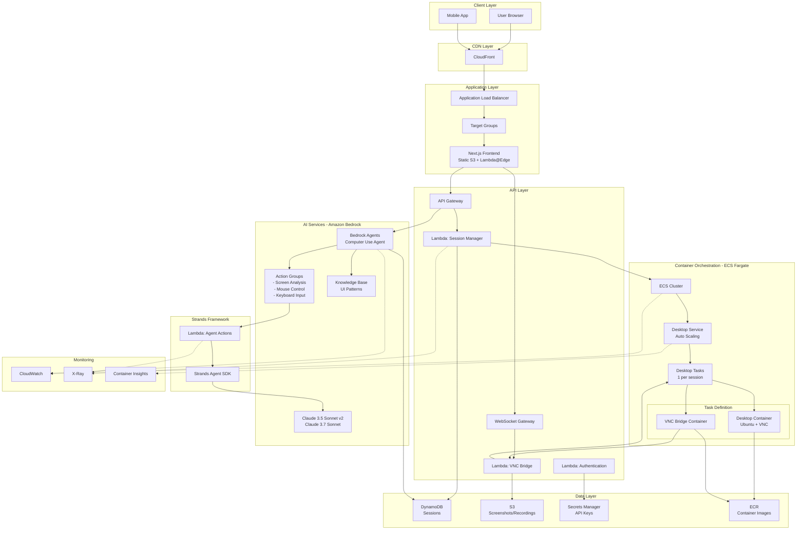
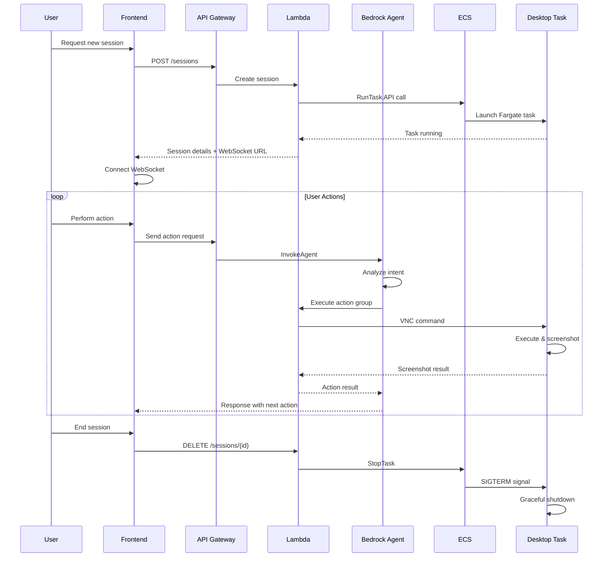

# Product Requirements Document: AWS Computer Use Demo

## Executive Summary

This PRD outlines the rearchitecture of Anthropic's Computer Use Demo for AWS deployment, transforming it from a single Docker container into a scalable, cloud-native application. The solution leverages AWS services including Amazon Bedrock for AI models, ECS Fargate for container orchestration, and modern web technologies following Test-Driven Development (TDD) principles.

## Project Overview

### Current State
- **Architecture**: Monolithic Docker container running Ubuntu with XVFB, VNC server, Streamlit frontend
- **Components**: Python agent loop, browser automation tools, desktop applications
- **Limitations**: Single-user sessions, no scalability, resource-intensive

### Target State
- **Architecture**: Microservices on AWS with ECS Fargate and containerized workloads
- **AI Platform**: Amazon Bedrock with Claude 3.5 Sonnet v2 and Claude 3.7 Sonnet
- **Components**: Next.js frontend, Python API services, isolated desktop environments
- **Benefits**: Multi-tenant support, auto-scaling, cost optimization, enhanced security

## System Architecture Flow Diagrams

### High-Level Architecture Flow



### Session Lifecycle Flow



### AI Agent Processing Flow

```mermaid
flowchart LR
    subgraph "Amazon Bedrock Agent"
        A[User Command] --> B[Agent Orchestration]
        B --> C[Intent Analysis]
        C --> D{Select Action Group}
    end
    
    subgraph "Action Groups (Strands Tools)"
        D -->|Screen Analysis| E[@tool: screenshot_analyzer]
        D -->|Mouse Action| F[@tool: vnc_controller]
        D -->|Keyboard| G[@tool: keyboard_input]
        D -->|Navigation| H[@tool: browser_navigate]
        
        E --> I[Lambda Handler]
        F --> I
        G --> I
        H --> I
    end
    
    subgraph "ECS Task Interaction"
        I --> J[HTTP to VNC Bridge]
        J --> K[Execute in Desktop]
        K --> L[Capture Screenshot]
        L --> M[Return to Agent]
    end
    
    subgraph "Agent Reasoning"
        M --> N[Claude 3.5 Sonnet v2<br/>Analyze Result]
        N --> O{Goal Achieved?}
        O -->|No| P[Plan Next Action]
        O -->|Yes| Q[Complete Task]
        P --> D
    end
    
    Q --> R[Return Results to User]
```

## Technical Architecture

### 1. Frontend Layer

#### Technology Stack
- **Framework**: Next.js 14+ with App Router
- **Language**: TypeScript
- **Styling**: Tailwind CSS + CSS Modules
- **UI Components**: Shadcn/ui + Radix UI
- **Animation**: Framer Motion
- **State Management**: Zustand/React Context
- **Real-time Communication**: WebSocket (Socket.io)

#### Key Features
```typescript
// Example component structure with TDD approach
// __tests__/components/ComputerView.test.tsx
describe('ComputerView Component', () => {
  it('should render VNC stream when session is active', () => {
    const { getByTestId } = render(<ComputerView sessionId="123" />);
    expect(getByTestId('vnc-container')).toBeInTheDocument();
  });

  it('should handle mouse click coordinates transformation', () => {
    const onClick = jest.fn();
    const { getByTestId } = render(<ComputerView onClick={onClick} />);
    fireEvent.click(getByTestId('vnc-canvas'), { clientX: 100, clientY: 200 });
    expect(onClick).toHaveBeenCalledWith({ x: 100, y: 200, scaled: true });
  });
});

// components/ComputerView.tsx
interface ComputerViewProps {
  sessionId: string;
  onClick?: (coords: ClickCoordinates) => void;
}

export const ComputerView: React.FC<ComputerViewProps> = ({ sessionId, onClick }) => {
  // Implementation with Framer Motion animations
  return (
    <motion.div
      initial={{ opacity: 0 }}
      animate={{ opacity: 1 }}
      className="relative w-full h-full"
    >
      <VNCViewer sessionId={sessionId} onMouseClick={onClick} />
    </motion.div>
  );
};
```

### 2. Backend Services with Amazon Bedrock Agents & Strands Framework

#### Using AWS Strands SDK for Agent Development
```python
# tests/test_strands_agent.py
import pytest
from unittest.mock import Mock, patch
from agents.computer_use_agent import ComputerUseAgent

class TestComputerUseAgent:
    @patch('strands.Agent')
    def test_agent_initialization(self, mock_agent):
        """Test Strands agent initialization"""
        agent = ComputerUseAgent()
        
        # Verify agent is created with correct configuration
        mock_agent.assert_called_once()
        assert agent.model == 'anthropic.claude-3-5-sonnet-20241022-v2:0'
        assert 'screenshot_analyzer' in agent.tools
        assert 'vnc_controller' in agent.tools
    
    @patch('strands.Agent.run')
    def test_agent_execution(self, mock_run):
        """Test agent task execution"""
        agent = ComputerUseAgent()
        mock_run.return_value = {
            'action': 'click',
            'coordinates': {'x': 100, 'y': 200},
            'reasoning': 'Clicking submit button'
        }
        
        result = agent.execute_task("Click the submit button")
        assert result['action'] == 'click'
        assert result['coordinates'] == {'x': 100, 'y': 200}

# agents/computer_use_agent.py
from strands import Agent, tool
from strands.mcp import mcp_tool
import boto3
import base64
from typing import Dict, Any, Optional
import asyncio

# Configure AWS region for Bedrock
import os
os.environ['AWS_REGION'] = 'us-east-1'

class ComputerUseAgent:
    """Computer Use Agent built with Strands framework"""
    
    def __init__(self):
        # Initialize the Strands agent with Claude 3.5 Sonnet v2
        self.agent = Agent(
            model='bedrock:anthropic.claude-3-5-sonnet-20241022-v2:0',
            prompt="""You are a computer use assistant that helps users interact with desktop applications.
            You can analyze screenshots, move the mouse, click, type, and perform various computer actions.
            Always explain your reasoning before taking actions."""
        )
        
        # Add tools to the agent
        self.agent.add_tool(self.screenshot_analyzer)
        self.agent.add_tool(self.vnc_controller)
        self.agent.add_tool(self.keyboard_input)
        self.agent.add_tool(self.mouse_movement)
    
    @tool
    def screenshot_analyzer(self, screenshot_base64: str) -> Dict[str, Any]:
        """
        Analyze a screenshot to understand the current screen state
        
        Args:
            screenshot_base64: Base64 encoded screenshot
            
        Returns:
            Analysis of visible elements and suggested actions
        """
        # The agent will use its vision capabilities to analyze the screenshot
        return {
            "analysis": "Screenshot received and ready for analysis",
            "format": "base64",
            "size": len(screenshot_base64)
        }
    
    @tool
    def vnc_controller(self, action: str, x: int = 0, y: int = 0, button: str = "left") -> Dict[str, Any]:
        """
        Control the VNC session with mouse actions
        
        Args:
            action: The action to perform (click, double_click, right_click)
            x: X coordinate
            y: Y coordinate
            button: Mouse button (left, right, middle)
            
        Returns:
            Result of the VNC action
        """
        # This will be implemented to send commands to the VNC server
        return {
            "action": action,
            "coordinates": {"x": x, "y": y},
            "button": button,
            "status": "executed"
        }
    
    @tool
    def keyboard_input(self, text: str, key_combination: Optional[str] = None) -> Dict[str, Any]:
        """
        Type text or send key combinations
        
        Args:
            text: Text to type
            key_combination: Special key combination (e.g., "ctrl+c", "alt+tab")
            
        Returns:
            Result of keyboard action
        """
        return {
            "typed": text if text else None,
            "key_combination": key_combination if key_combination else None,
            "status": "executed"
        }
    
    @tool
    def mouse_movement(self, x: int, y: int, duration: float = 0.5) -> Dict[str, Any]:
        """
        Move mouse to specific coordinates
        
        Args:
            x: Target X coordinate
            y: Target Y coordinate
            duration: Duration of movement in seconds
            
        Returns:
            Result of mouse movement
        """
        return {
            "moved_to": {"x": x, "y": y},
            "duration": duration,
            "status": "executed"
        }
    
    async def execute_task(self, user_intent: str, screenshot: Optional[str] = None) -> Dict[str, Any]:
        """
        Execute a computer use task
        
        Args:
            user_intent: What the user wants to achieve
            screenshot: Optional current screenshot
            
        Returns:
            Result of the task execution
        """
        # Prepare the input for the agent
        agent_input = f"User intent: {user_intent}"
        
        if screenshot:
            agent_input += f"\n\nCurrent screenshot is available for analysis."
            # The agent will use the screenshot_analyzer tool automatically
        
        # Run the agent
        result = await self.agent.run(agent_input)
        
        return result

# Lambda handler for Bedrock Agent Action Groups
def lambda_handler(event, context):
    """
    Lambda function to handle Bedrock Agent action group requests
    
    This function is called by Amazon Bedrock Agents when executing actions
    """
    action_group = event.get('actionGroup')
    api_path = event.get('apiPath')
    parameters = event.get('parameters', [])
    
    # Initialize our Strands-based agent
    agent = ComputerUseAgent()
    
    # Route to appropriate action
    if api_path == '/analyze-screen':
        screenshot = next((p['value'] for p in parameters if p['name'] == 'screenshot'), None)
        intent = next((p['value'] for p in parameters if p['name'] == 'intent'), None)
        
        # Execute the task asynchronously
        result = asyncio.run(agent.execute_task(intent, screenshot))
        
        return {
            'response': {
                'actionGroup': action_group,
                'apiPath': api_path,
                'httpStatusCode': 200,
                'responseBody': {
                    'application/json': {
                        'body': json.dumps(result)
                    }
                }
            }
        }
    
    elif api_path == '/execute-action':
        action_type = next((p['value'] for p in parameters if p['name'] == 'action'), None)
        coordinates = next((p['value'] for p in parameters if p['name'] == 'coordinates'), None)
        
        if action_type == 'click' and coordinates:
            coords = json.loads(coordinates)
            result = agent.vnc_controller('click', coords['x'], coords['y'])
        else:
            result = {'error': 'Invalid action parameters'}
        
        return {
            'response': {
                'actionGroup': action_group,
                'apiPath': api_path,
                'httpStatusCode': 200,
                'responseBody': {
                    'application/json': {
                        'body': json.dumps(result)
                    }
                }
            }
        }
    
    return {
        'response': {
            'actionGroup': action_group,
            'apiPath': api_path,
            'httpStatusCode': 404,
            'responseBody': {
                'application/json': {
                    'body': json.dumps({'error': 'Unknown API path'})
                }
            }
        }
    }

# Amazon Bedrock Agent configuration
def create_bedrock_agent():
    """
    Create and configure Amazon Bedrock Agent for computer use
    
    This would typically be done via Terraform or AWS Console
    """
    bedrock_agent = boto3.client('bedrock-agent')
    
    # Create the agent
    agent_response = bedrock_agent.create_agent(
        agentName='computer-use-agent',
        agentResourceRoleArn='arn:aws:iam::account:role/BedrockAgentRole',
        description='AI agent for computer use automation',
        foundationModel='anthropic.claude-3-5-sonnet-20241022-v2:0',
        instruction="""You are a computer use assistant that helps users control desktop applications.
        You can analyze screenshots, click on elements, type text, and navigate applications.
        Always explain what you're doing and why.""",
        idleSessionTTLInSeconds=600
    )
    
    # Create action group for computer control
    action_group_response = bedrock_agent.create_agent_action_group(
        agentId=agent_response['agent']['agentId'],
        agentVersion='DRAFT',
        actionGroupName='computer-control',
        actionGroupExecutor={
            'lambda': 'arn:aws:lambda:us-east-1:account:function:computer-use-handler'
        },
        apiSchema={
            'payload': '''
            openapi: 3.0.0
            info:
              title: Computer Use API
              version: 1.0.0
            paths:
              /analyze-screen:
                post:
                  summary: Analyze screenshot and determine next action
                  parameters:
                    - name: screenshot
                      in: query
                      required: true
                      schema:
                        type: string
                    - name: intent
                      in: query
                      required: true
                      schema:
                        type: string
              /execute-action:
                post:
                  summary: Execute a computer action
                  parameters:
                    - name: action
                      in: query
                      required: true
                      schema:
                        type: string
                        enum: [click, type, scroll, key_combination]
                    - name: coordinates
                      in: query
                      required: false
                      schema:
                        type: string
                    - name: text
                      in: query
                      required: false
                      schema:
                        type: string
            '''
        }
    )
    
    return agent_response['agent']['agentId']
```

### 3. Bedrock Agent Action Group Schema

```yaml
# schemas/computer-control-api.yaml
openapi: 3.0.0
info:
  title: Computer Use Control API
  version: 1.0.0
  description: API for controlling desktop environment via VNC

paths:
  /analyze-screen:
    post:
      summary: Analyze screenshot and determine next action
      description: Uses Claude's vision capabilities to understand the current screen
      operationId: analyzeScreen
      parameters:
        - name: screenshot
          in: query
          required: true
          description: Base64 encoded screenshot of current screen
          schema:
            type: string
        - name: intent
          in: query
          required: true
          description: What the user wants to achieve
          schema:
            type: string
        - name: context
          in: query
          required: false
          description: Previous actions or additional context
          schema:
            type: string
      responses:
        '200':
          description: Analysis complete with suggested action
          content:
            application/json:
              schema:
                type: object
                properties:
                  action:
                    type: string
                    enum: [click, type, scroll, key_combination, wait]
                  coordinates:
                    type: object
                    properties:
                      x:
                        type: integer
                      y:
                        type: integer
                  text:
                    type: string
                  reasoning:
                    type: string

  /execute-action:
    post:
      summary: Execute a computer control action
      description: Performs mouse, keyboard, or other actions on the desktop
      operationId: executeAction
      parameters:
        - name: action
          in: query
          required: true
          schema:
            type: string
            enum: [click, double_click, right_click, type, scroll, key_combination, drag]
        - name: coordinates
          in: query
          required: false
          description: JSON string with x,y coordinates for mouse actions
          schema:
            type: string
        - name: text
          in: query
          required: false
          description: Text to type or key combination
          schema:
            type: string
        - name: direction
          in: query
          required: false
          description: Scroll direction (up/down) and amount
          schema:
            type: string
      responses:
        '200':
          description: Action executed successfully
          content:
            application/json:
              schema:
                type: object
                properties:
                  success:
                    type: boolean
                  action:
                    type: string
                  result:
                    type: object
                  screenshot:
                    type: string
                    description: Base64 encoded screenshot after action

  /capture-screenshot:
    get:
      summary: Capture current screen
      description: Takes a screenshot of the current desktop state
      operationId: captureScreenshot
      responses:
        '200':
          description: Screenshot captured
          content:
            application/json:
              schema:
                type: object
                properties:
                  screenshot:
                    type: string
                    description: Base64 encoded PNG image
                  timestamp:
                    type: string
                    format: date-time
                  resolution:
                    type: object
                    properties:
                      width:
                        type: integer
                      height:
                        type: integer

  /get-screen-text:
    post:
      summary: Extract text from screen region
      description: Uses OCR to extract text from a specific screen region
      operationId: getScreenText
      parameters:
        - name: x1
          in: query
          required: true
          schema:
            type: integer
        - name: y1
          in: query
          required: true
          schema:
            type: integer
        - name: x2
          in: query
          required: true
          schema:
            type: integer
        - name: y2
          in: query
          required: true
          schema:
            type: integer
      responses:
        '200':
          description: Text extracted successfully
          content:
            application/json:
              schema:
                type: object
                properties:
                  text:
                    type: string
                  confidence:
                    type: number
                    format: float
```

### 4. Infrastructure as Code (Terraform) with ECS Fargate & Bedrock Agents

```hcl
# terraform/main.tf
terraform {
  required_version = ">= 1.0"
  required_providers {
    aws = {
      source  = "hashicorp/aws"
      version = "~> 5.0"
    }
  }
}

# VPC Configuration
module "vpc" {
  source = "terraform-aws-modules/vpc/aws"
  version = "5.0.0"
  
  name = "computer-use-vpc-${var.environment}"
  cidr = "10.0.0.0/16"
  
  azs             = data.aws_availability_zones.available.names
  private_subnets = ["10.0.1.0/24", "10.0.2.0/24", "10.0.3.0/24"]
  public_subnets  = ["10.0.101.0/24", "10.0.102.0/24", "10.0.103.0/24"]
  
  enable_nat_gateway = true
  enable_vpn_gateway = true
  enable_dns_hostnames = true
  
  tags = {
    Project = "computer-use-demo"
    Environment = var.environment
  }
}

# ECS Cluster
resource "aws_ecs_cluster" "main" {
  name = "computer-use-${var.environment}"
  
  setting {
    name  = "containerInsights"
    value = "enabled"
  }
  
  configuration {
    execute_command_configuration {
      logging = "OVERRIDE"
      log_configuration {
        cloud_watch_log_group_name = aws_cloudwatch_log_group.ecs.name
      }
    }
  }
}

# Add Fargate capacity providers
resource "aws_ecs_cluster_capacity_providers" "main" {
  cluster_name = aws_ecs_cluster.main.name
  
  capacity_providers = ["FARGATE", "FARGATE_SPOT"]
  
  default_capacity_provider_strategy {
    base              = 1
    weight            = 100
    capacity_provider = "FARGATE"
  }
}

# Task Definition for Desktop Environment
resource "aws_ecs_task_definition" "desktop" {
  family                   = "computer-use-desktop"
  network_mode            = "awsvpc"
  requires_compatibilities = ["FARGATE"]
  cpu                     = "2048"  # 2 vCPU
  memory                  = "4096"  # 4 GB
  execution_role_arn      = aws_iam_role.ecs_execution.arn
  task_role_arn          = aws_iam_role.ecs_task.arn
  
  container_definitions = jsonencode([
    {
      name  = "desktop"
      image = "${aws_ecr_repository.desktop.repository_url}:latest"
      
      portMappings = [
        {
          containerPort = 5900  # VNC
          protocol      = "tcp"
        },
        {
          containerPort = 6080  # noVNC
          protocol      = "tcp"
        }
      ]
      
      environment = [
        {
          name  = "DISPLAY"
          value = ":1"
        },
        {
          name  = "VNC_RESOLUTION"
          value = "1920x1080"
        }
      ]
      
      secrets = [
        {
          name      = "VNC_PASSWORD"
          valueFrom = aws_secretsmanager_secret.vnc_password.arn
        }
      ]
      
      healthCheck = {
        command     = ["CMD-SHELL", "curl -f http://localhost:6080/ || exit 1"]
        interval    = 30
        timeout     = 5
        retries     = 3
        startPeriod = 60
      }
      
      logConfiguration = {
        logDriver = "awslogs"
        options = {
          "awslogs-group"         = aws_cloudwatch_log_group.desktop.name
          "awslogs-region"        = var.aws_region
          "awslogs-stream-prefix" = "desktop"
        }
      }
      
      mountPoints = [
        {
          sourceVolume  = "dshm"
          containerPath = "/dev/shm"
        }
      ]
    },
    {
      name  = "vnc-bridge"
      image = "${aws_ecr_repository.vnc_bridge.repository_url}:latest"
      
      portMappings = [
        {
          containerPort = 8080  # API endpoint
          protocol      = "tcp"
        }
      ]
      
      environment = [
        {
          name  = "VNC_HOST"
          value = "localhost"
        },
        {
          name  = "VNC_PORT"
          value = "5900"
        },
        {
          name  = "S3_BUCKET"
          value = aws_s3_bucket.assets.id
        },
        {
          name  = "AWS_REGION"
          value = var.aws_region
        }
      ]
      
      dependsOn = [
        {
          containerName = "desktop"
          condition     = "HEALTHY"
        }
      ]
      
      logConfiguration = {
        logDriver = "awslogs"
        options = {
          "awslogs-group"         = aws_cloudwatch_log_group.vnc_bridge.name
          "awslogs-region"        = var.aws_region
          "awslogs-stream-prefix" = "vnc-bridge"
        }
      }
    }
  ])
  
  volume {
    name = "dshm"
    
    # EFS is not needed, using tmpfs for shared memory
    docker_volume_configuration {
      scope         = "task"
      driver        = "local"
      driver_opts = {
        type   = "tmpfs"
        device = "tmpfs"
        o      = "size=1024m"
      }
    }
  }
}

# ECS Service
resource "aws_ecs_service" "desktop" {
  name            = "desktop-service"
  cluster         = aws_ecs_cluster.main.id
  task_definition = aws_ecs_task_definition.desktop.arn
  desired_count   = 0  # Start with 0, scale based on demand
  
  capacity_provider_strategy {
    capacity_provider = "FARGATE_SPOT"
    weight           = 80
    base             = 0
  }
  
  capacity_provider_strategy {
    capacity_provider = "FARGATE"
    weight           = 20
    base             = 0
  }
  
  network_configuration {
    subnets          = module.vpc.private_subnets
    security_groups  = [aws_security_group.desktop.id]
    assign_public_ip = false
  }
  
  load_balancer {
    target_group_arn = aws_lb_target_group.desktop.arn
    container_name   = "desktop"
    container_port   = 6080
  }
  
  service_registries {
    registry_arn = aws_service_discovery_service.desktop.arn
  }
  
  enable_execute_command = true
  
  deployment_configuration {
    maximum_percent         = 200
    minimum_healthy_percent = 0  # Allow scale to zero
  }
}

# Auto Scaling
resource "aws_appautoscaling_target" "desktop" {
  max_capacity       = 100
  min_capacity       = 0
  resource_id        = "service/${aws_ecs_cluster.main.name}/${aws_ecs_service.desktop.name}"
  scalable_dimension = "ecs:service:DesiredCount"
  service_namespace  = "ecs"
}

# Scale based on active sessions
resource "aws_appautoscaling_policy" "desktop_sessions" {
  name               = "scale-by-sessions"
  policy_type        = "TargetTrackingScaling"
  resource_id        = aws_appautoscaling_target.desktop.resource_id
  scalable_dimension = aws_appautoscaling_target.desktop.scalable_dimension
  service_namespace  = aws_appautoscaling_target.desktop.service_namespace
  
  target_tracking_scaling_policy_configuration {
    target_value = 1.0  # One task per active session
    
    customized_metric_specification {
      metric_name = "ActiveSessions"
      namespace   = "ComputerUse"
      statistic   = "Average"
      unit        = "Count"
    }
    
    scale_in_cooldown  = 60
    scale_out_cooldown = 0
  }
}

# Service Discovery
resource "aws_service_discovery_private_dns_namespace" "main" {
  name = "computer-use.local"
  vpc  = module.vpc.id
}

resource "aws_service_discovery_service" "desktop" {
  name = "desktop"
  
  dns_config {
    namespace_id = aws_service_discovery_private_dns_namespace.main.id
    
    dns_records {
      ttl  = 10
      type = "A"
    }
  }
  
  health_check_custom_config {
    failure_threshold = 1
  }
}

# Amazon Bedrock Agent Configuration
resource "aws_bedrock_agent" "computer_use" {
  agent_name              = "computer-use-agent-${var.environment}"
  agent_resource_role_arn = aws_iam_role.bedrock_agent.arn
  description             = "AI agent for computer use automation using Strands framework"
  foundation_model        = "anthropic.claude-3-5-sonnet-20241022-v2:0"
  
  instruction = <<-EOT
    You are a computer use assistant that helps users control desktop applications.
    You can analyze screenshots, click on elements, type text, and navigate applications.
    Always explain what you're doing and why. Follow these guidelines:
    
    1. Analyze the current screen state before taking actions
    2. Verify actions were successful by checking screenshots
    3. Handle errors gracefully and retry if needed
    4. Provide clear feedback about what you're doing
  EOT
  
  idle_session_ttl_in_seconds = 600
  
  guardrail_configuration {
    guardrail_identifier = aws_bedrock_guardrail.computer_use.id
    guardrail_version    = "DRAFT"
  }
}

# Action Group for Computer Control
resource "aws_bedrock_agent_action_group" "computer_control" {
  agent_id             = aws_bedrock_agent.computer_use.id
  agent_version        = "DRAFT"
  action_group_name    = "computer-control"
  description          = "Actions for controlling computer via VNC"
  
  action_group_executor {
    lambda = aws_lambda_function.strands_agent_handler.arn
  }
  
  api_schema {
    payload = file("${path.module}/schemas/computer-control-api.yaml")
  }
}

# Knowledge Base for UI Patterns
resource "aws_bedrock_knowledge_base" "ui_patterns" {
  name        = "computer-use-ui-patterns-${var.environment}"
  description = "Knowledge base for common UI patterns and interactions"
  role_arn    = aws_iam_role.bedrock_kb.arn
  
  storage_configuration {
    type = "OPENSEARCH_SERVERLESS"
    
    opensearch_serverless_configuration {
      collection_arn = aws_opensearchserverless_collection.ui_patterns.arn
      vector_index_name = "ui-patterns"
      
      field_mapping {
        vector_field   = "embedding"
        text_field     = "text"
        metadata_field = "metadata"
      }
    }
  }
  
  knowledge_base_configuration {
    type = "VECTOR"
    
    vector_knowledge_base_configuration {
      embedding_model_arn = data.aws_bedrock_foundation_model.titan_embed.model_arn
    }
  }
}

# Lambda Function for Strands Agent
resource "aws_lambda_function" "strands_agent_handler" {
  function_name = "computer-use-strands-agent-${var.environment}"
  role          = aws_iam_role.lambda_strands.arn
  handler       = "lambda_handler.lambda_handler"
  runtime       = "python3.12"
  timeout       = 300
  memory_size   = 1024
  
  filename         = "${path.module}/lambda/strands-agent.zip"
  source_code_hash = filebase64sha256("${path.module}/lambda/strands-agent.zip")
  
  environment {
    variables = {
      AWS_REGION       = var.aws_region
      ECS_CLUSTER_NAME = aws_ecs_cluster.main.name
      VNC_SERVICE_URL  = "http://desktop.computer-use.local:8080"
      SESSION_TABLE    = aws_dynamodb_table.sessions.name
    }
  }
  
  layers = [
    aws_lambda_layer_version.strands_sdk.arn,
    aws_lambda_layer_version.boto3_latest.arn
  ]
}

# Lambda Layer for Strands SDK
resource "aws_lambda_layer_version" "strands_sdk" {
  layer_name          = "strands-sdk-${var.environment}"
  description         = "Strands Agent SDK and dependencies"
  compatible_runtimes = ["python3.12"]
  
  filename         = "${path.module}/layers/strands-sdk.zip"
  source_code_hash = filebase64sha256("${path.module}/layers/strands-sdk.zip")
}

# Lambda for Session Management
resource "aws_lambda_function" "session_manager" {
  function_name = "computer-use-session-manager-${var.environment}"
  role         = aws_iam_role.lambda_session.arn
  handler      = "index.handler"
  runtime      = "python3.12"
  timeout      = 60
  
  environment {
    variables = {
      ECS_CLUSTER      = aws_ecs_cluster.main.name
      ECS_SERVICE      = aws_ecs_service.desktop.name
      TASK_DEFINITION  = aws_ecs_task_definition.desktop.family
      SUBNETS          = join(",", module.vpc.private_subnets)
      SECURITY_GROUP   = aws_security_group.desktop.id
      SESSION_TABLE    = aws_dynamodb_table.sessions.name
    }
  }
}

# Bedrock Guardrails
resource "aws_bedrock_guardrail" "computer_use" {
  name        = "computer-use-guardrail-${var.environment}"
  description = "Safety guardrails for computer use agent"
  
  blocked_input_messaging  = "I cannot process that request as it may violate safety guidelines."
  blocked_outputs_messaging = "I cannot provide that response as it may contain unsafe content."
  
  content_policy_config {
    filters_config {
      type            = "HATE"
      input_strength  = "HIGH"
      output_strength = "HIGH"
    }
    
    filters_config {
      type            = "VIOLENCE"
      input_strength  = "HIGH"
      output_strength = "HIGH"
    }
  }
  
  sensitive_information_policy_config {
    pii_entities_config {
      type   = "EMAIL"
      action = "BLOCK"
    }
    
    pii_entities_config {
      type   = "CREDIT_DEBIT_CARD_NUMBER"
      action = "BLOCK"
    }
  }
}

# API Gateway for REST endpoints
resource "aws_apigatewayv2_api" "main" {
  name          = "computer-use-api-${var.environment}"
  protocol_type = "HTTP"
  
  cors_configuration {
    allow_origins     = var.allowed_origins
    allow_methods     = ["GET", "POST", "PUT", "DELETE", "OPTIONS"]
    allow_headers     = ["content-type", "authorization"]
    expose_headers    = ["x-session-id"]
    max_age          = 300
    allow_credentials = true
  }
}

# WebSocket API for real-time communication
resource "aws_apigatewayv2_api" "websocket" {
  name                       = "computer-use-ws-${var.environment}"
  protocol_type              = "WEBSOCKET"
  route_selection_expression = "$request.body.action"
}

# DynamoDB for session management
resource "aws_dynamodb_table" "sessions" {
  name           = "computer-use-sessions-${var.environment}"
  billing_mode   = "PAY_PER_REQUEST"
  hash_key       = "session_id"
  
  attribute {
    name = "session_id"
    type = "S"
  }
  
  attribute {
    name = "user_id"
    type = "S"
  }
  
  global_secondary_index {
    name            = "user-index"
    hash_key        = "user_id"
    projection_type = "ALL"
  }
  
  ttl {
    attribute_name = "ttl"
    enabled        = true
  }
}

# S3 for static assets and recordings
resource "aws_s3_bucket" "assets" {
  bucket = "computer-use-assets-${var.environment}-${data.aws_caller_identity.current.account_id}"
}

resource "aws_s3_bucket_versioning" "assets" {
  bucket = aws_s3_bucket.assets.id
  versioning_configuration {
    status = "Enabled"
  }
}

# ECR Repositories
resource "aws_ecr_repository" "desktop" {
  name                 = "computer-use/desktop"
  image_tag_mutability = "MUTABLE"
  
  image_scanning_configuration {
    scan_on_push = true
  }
}

resource "aws_ecr_repository" "vnc_bridge" {
  name                 = "computer-use/vnc-bridge"
  image_tag_mutability = "MUTABLE"
  
  image_scanning_configuration {
    scan_on_push = true
  }
}

# CloudFront for global content delivery
resource "aws_cloudfront_distribution" "main" {
  enabled             = true
  is_ipv6_enabled     = true
  default_root_object = "index.html"
  
  origin {
    domain_name = aws_s3_bucket_website_configuration.frontend.website_endpoint
    origin_id   = "S3-Frontend"
    
    custom_origin_config {
      http_port              = 80
      https_port             = 443
      origin_protocol_policy = "http-only"
      origin_ssl_protocols   = ["TLSv1.2"]
    }
  }
  
  default_cache_behavior {
    allowed_methods  = ["GET", "HEAD", "OPTIONS"]
    cached_methods   = ["GET", "HEAD"]
    target_origin_id = "S3-Frontend"
    
    forwarded_values {
      query_string = false
      cookies {
        forward = "none"
      }
    }
    
    viewer_protocol_policy = "redirect-to-https"
    min_ttl                = 0
    default_ttl            = 3600
    max_ttl                = 86400
  }
  
  restrictions {
    geo_restriction {
      restriction_type = "none"
    }
  }
  
  viewer_certificate {
    cloudfront_default_certificate = true
  }
}

# Target Group
resource "aws_lb_target_group" "desktop" {
  name        = "desktop-tg-${var.environment}"
  port        = 6080
  protocol    = "HTTP"
  vpc_id      = module.vpc.id
  target_type = "ip"  # Required for Fargate
  
  health_check {
    enabled             = true
    healthy_threshold   = 2
    unhealthy_threshold = 2
    timeout             = 5
    interval            = 30
    path                = "/"
    matcher             = "200"
  }
  
  deregistration_delay = 30  # Quick deregistration
}

# Application Load Balancer
resource "aws_lb" "main" {
  name               = "computer-use-alb-${var.environment}"
  internal           = false
  load_balancer_type = "application"
  security_groups    = [aws_security_group.alb.id]
  subnets           = module.vpc.public_subnets
  
  enable_deletion_protection = false
  enable_http2              = true
}

resource "aws_lb_listener" "web" {
  load_balancer_arn = aws_lb.main.arn
  port              = "443"
  protocol          = "HTTPS"
  ssl_policy        = "ELBSecurityPolicy-TLS-1-2-2017-01"
  certificate_arn   = aws_acm_certificate.main.arn
  
  default_action {
    type             = "forward"
    target_group_arn = aws_lb_target_group.desktop.arn
  }
}

# Security Groups
resource "aws_security_group" "desktop" {
  name        = "computer-use-desktop-${var.environment}"
  description = "Security group for desktop containers"
  vpc_id      = module.vpc.id
  
  ingress {
    from_port       = 6080
    to_port         = 6080
    protocol        = "tcp"
    security_groups = [aws_security_group.alb.id]
  }
  
  ingress {
    from_port       = 8080
    to_port         = 8080
    protocol        = "tcp"
    security_groups = [aws_security_group.lambda.id]
  }
  
  egress {
    from_port   = 0
    to_port     = 0
    protocol    = "-1"
    cidr_blocks = ["0.0.0.0/0"]
  }
}

resource "aws_security_group" "alb" {
  name        = "computer-use-alb-${var.environment}"
  description = "Security group for ALB"
  vpc_id      = module.vpc.id
  
  ingress {
    from_port   = 443
    to_port     = 443
    protocol    = "tcp"
    cidr_blocks = ["0.0.0.0/0"]
  }
  
  egress {
    from_port   = 0
    to_port     = 0
    protocol    = "-1"
    cidr_blocks = ["0.0.0.0/0"]
  }
}

resource "aws_security_group" "lambda" {
  name        = "computer-use-lambda-${var.environment}"
  description = "Security group for Lambda functions"
  vpc_id      = module.vpc.id
  
  egress {
    from_port   = 0
    to_port     = 0
    protocol    = "-1"
    cidr_blocks = ["0.0.0.0/0"]
  }
}
```

### 5. Container Architecture for ECS (Desktop Environment Only)

```dockerfile
# docker/desktop/Dockerfile
FROM ubuntu:22.04

# Install required packages
RUN apt-get update && apt-get install -y \
    xvfb \
    x11vnc \
    novnc \
    supervisor \
    firefox \
    python3.12 \
    python3-pip \
    curl \
    jq \
    && rm -rf /var/lib/apt/lists/*

# Install VNC bridge dependencies
COPY requirements.txt /app/
RUN pip3 install --no-cache-dir -r /app/requirements.txt

# Copy VNC bridge application
COPY src/vnc_bridge/ /app/vnc_bridge/

# Configure supervisor
COPY supervisord.conf /etc/supervisor/conf.d/

# Add startup script
COPY start.sh /start.sh
RUN chmod +x /start.sh

# Add health check
HEALTHCHECK --interval=30s --timeout=3s --start-period=5s --retries=3 \
  CMD curl -f http://localhost:6080/ || exit 1

EXPOSE 5900 6080 8080

CMD ["/start.sh"]
```

```python
# src/vnc_bridge/bridge.py
"""
VNC Bridge Service
Handles communication between Bedrock Agents and VNC server
"""
import asyncio
import base64
import json
import boto3
from fastapi import FastAPI, WebSocket
from fastapi.responses import JSONResponse
import vncdotool
from typing import Dict, Any, Optional
import os
import time
from datetime import datetime

app = FastAPI()
s3_client = boto3.client('s3')

class VNCBridge:
    """Bridge between agent actions and VNC server"""
    
    def __init__(self, vnc_host: str = 'localhost', vnc_port: int = 5900):
        self.vnc_host = vnc_host
        self.vnc_port = vnc_port
        self.client = None
    
    async def connect(self):
        """Connect to VNC server"""
        self.client = vncdotool.api.connect(f'{self.vnc_host}:{self.vnc_port}')
    
    async def screenshot(self) -> str:
        """Capture screenshot and return base64 encoded"""
        if not self.client:
            await self.connect()
        
        # Capture screenshot
        self.client.refreshScreen()
        image = self.client.screen
        
        # Convert to base64
        import io
        from PIL import Image
        buffer = io.BytesIO()
        Image.fromarray(image).save(buffer, format='PNG')
        return base64.b64encode(buffer.getvalue()).decode()
    
    async def click(self, x: int, y: int, button: str = 'left') -> Dict[str, Any]:
        """Perform mouse click"""
        if not self.client:
            await self.connect()
        
        button_map = {'left': 1, 'middle': 2, 'right': 3}
        self.client.mousePress(x, y, button_map.get(button, 1))
        
        return {'action': 'click', 'x': x, 'y': y, 'button': button}
    
    async def type_text(self, text: str) -> Dict[str, Any]:
        """Type text via VNC"""
        if not self.client:
            await self.connect()
        
        self.client.type(text)
        return {'action': 'type', 'text': text}
    
    async def key_combination(self, keys: str) -> Dict[str, Any]:
        """Send key combination (e.g., 'ctrl-c')"""
        if not self.client:
            await self.connect()
        
        self.client.keyPress(keys)
        return {'action': 'key_combination', 'keys': keys}

# Global VNC bridge instance
vnc_bridge = VNCBridge()

@app.post("/vnc/screenshot")
async def capture_screenshot():
    """API endpoint for capturing screenshots"""
    try:
        screenshot = await vnc_bridge.screenshot()
        
        # Optionally save to S3
        if os.environ.get('S3_BUCKET'):
            key = f"screenshots/{os.environ.get('SESSION_ID')}/{int(time.time())}.png"
            s3_client.put_object(
                Bucket=os.environ['S3_BUCKET'],
                Key=key,
                Body=base64.b64decode(screenshot),
                ContentType='image/png'
            )
        
        return JSONResponse({
            'success': True,
            'screenshot': screenshot,
            'timestamp': datetime.now().isoformat()
        })
    except Exception as e:
        return JSONResponse({
            'success': False,
            'error': str(e)
        }, status_code=500)

@app.post("/vnc/click")
async def handle_click(x: int, y: int, button: str = 'left'):
    """API endpoint for mouse clicks"""
    try:
        result = await vnc_bridge.click(x, y, button)
        return JSONResponse({
            'success': True,
            **result
        })
    except Exception as e:
        return JSONResponse({
            'success': False,
            'error': str(e)
        }, status_code=500)

@app.post("/vnc/type")
async def handle_type(text: str):
    """API endpoint for typing text"""
    try:
        result = await vnc_bridge.type_text(text)
        return JSONResponse({
            'success': True,
            **result
        })
    except Exception as e:
        return JSONResponse({
            'success': False,
            'error': str(e)
        }, status_code=500)

@app.websocket("/ws/{session_id}")
async def websocket_endpoint(websocket: WebSocket, session_id: str):
    """WebSocket endpoint for real-time VNC streaming"""
    await websocket.accept()
    
    try:
        while True:
            # Send periodic screenshots
            screenshot = await vnc_bridge.screenshot()
            await websocket.send_json({
                'type': 'screenshot',
                'data': screenshot,
                'timestamp': datetime.now().isoformat()
            })
            
            # Wait for next frame (30 FPS)
            await asyncio.sleep(1/30)
            
    except Exception as e:
        await websocket.close()

if __name__ == "__main__":
    import uvicorn
    uvicorn.run(app, host="0.0.0.0", port=8080)
```

### 6. Security & Compliance

#### IAM Roles and Policies
```hcl
# terraform/iam.tf
# ECS Execution Role
resource "aws_iam_role" "ecs_execution" {
  name = "computer-use-ecs-execution-${var.environment}"
  
  assume_role_policy = jsonencode({
    Version = "2012-10-17"
    Statement = [{
      Action = "sts:AssumeRole"
      Effect = "Allow"
      Principal = {
        Service = "ecs-tasks.amazonaws.com"
      }
    }]
  })
}

resource "aws_iam_role_policy_attachment" "ecs_execution_basic" {
  role       = aws_iam_role.ecs_execution.name
  policy_arn = "arn:aws:iam::aws:policy/service-role/AmazonECSTaskExecutionRolePolicy"
}

resource "aws_iam_policy" "ecs_execution_secrets" {
  name = "computer-use-ecs-execution-secrets-${var.environment}"
  
  policy = jsonencode({
    Version = "2012-10-17"
    Statement = [
      {
        Effect = "Allow"
        Action = [
          "secretsmanager:GetSecretValue"
        ]
        Resource = [
          aws_secretsmanager_secret.vnc_password.arn
        ]
      }
    ]
  })
}

resource "aws_iam_role_policy_attachment" "ecs_execution_secrets" {
  role       = aws_iam_role.ecs_execution.name
  policy_arn = aws_iam_policy.ecs_execution_secrets.arn
}

# ECS Task Role
resource "aws_iam_role" "ecs_task" {
  name = "computer-use-ecs-task-${var.environment}"
  
  assume_role_policy = jsonencode({
    Version = "2012-10-17"
    Statement = [{
      Action = "sts:AssumeRole"
      Effect = "Allow"
      Principal = {
        Service = "ecs-tasks.amazonaws.com"
      }
    }]
  })
}

resource "aws_iam_policy" "ecs_task" {
  name = "computer-use-ecs-task-policy-${var.environment}"
  
  policy = jsonencode({
    Version = "2012-10-17"
    Statement = [
      {
        Effect = "Allow"
        Action = [
          "s3:PutObject",
          "s3:GetObject"
        ]
        Resource = "${aws_s3_bucket.assets.arn}/*"
      },
      {
        Effect = "Allow"
        Action = [
          "dynamodb:UpdateItem",
          "dynamodb:GetItem"
        ]
        Resource = aws_dynamodb_table.sessions.arn
      },
      {
        Effect = "Allow"
        Action = [
          "ssmmessages:CreateControlChannel",
          "ssmmessages:CreateDataChannel",
          "ssmmessages:OpenControlChannel",
          "ssmmessages:OpenDataChannel"
        ]
        Resource = "*"
      }
    ]
  })
}

resource "aws_iam_role_policy_attachment" "ecs_task" {
  role       = aws_iam_role.ecs_task.name
  policy_arn = aws_iam_policy.ecs_task.arn
}

# Lambda Session Manager Role
resource "aws_iam_role" "lambda_session" {
  name = "computer-use-lambda-session-${var.environment}"
  
  assume_role_policy = jsonencode({
    Version = "2012-10-17"
    Statement = [{
      Action = "sts:AssumeRole"
      Effect = "Allow"
      Principal = {
        Service = "lambda.amazonaws.com"
      }
    }]
  })
}

resource "aws_iam_policy" "lambda_session" {
  name = "computer-use-lambda-session-policy-${var.environment}"
  
  policy = jsonencode({
    Version = "2012-10-17"
    Statement = [
      {
        Effect = "Allow"
        Action = [
          "ecs:RunTask",
          "ecs:StopTask",
          "ecs:DescribeTasks"
        ]
        Resource = "*"
        Condition = {
          ArnEquals = {
            "ecs:cluster" = aws_ecs_cluster.main.arn
          }
        }
      },
      {
        Effect = "Allow"
        Action = [
          "iam:PassRole"
        ]
        Resource = [
          aws_iam_role.ecs_execution.arn,
          aws_iam_role.ecs_task.arn
        ]
      },
      {
        Effect = "Allow"
        Action = [
          "dynamodb:GetItem",
          "dynamodb:PutItem",
          "dynamodb:UpdateItem",
          "dynamodb:Query"
        ]
        Resource = [
          aws_dynamodb_table.sessions.arn,
          "${aws_dynamodb_table.sessions.arn}/index/*"
        ]
      },
      {
        Effect = "Allow"
        Action = [
          "cloudwatch:PutMetricData"
        ]
        Resource = "*"
      }
    ]
  })
}

resource "aws_iam_role_policy_attachment" "lambda_session_basic" {
  policy_arn = "arn:aws:iam::aws:policy/service-role/AWSLambdaBasicExecutionRole"
  role       = aws_iam_role.lambda_session.name
}

resource "aws_iam_role_policy_attachment" "lambda_session_vpc" {
  policy_arn = "arn:aws:iam::aws:policy/service-role/AWSLambdaVPCAccessExecutionRole"
  role       = aws_iam_role.lambda_session.name
}

resource "aws_iam_role_policy_attachment" "lambda_session_custom" {
  policy_arn = aws_iam_policy.lambda_session.arn
  role       = aws_iam_role.lambda_session.name
}

# Bedrock Agent IAM Role
resource "aws_iam_role" "bedrock_agent" {
  name = "computer-use-bedrock-agent-${var.environment}"
  
  assume_role_policy = jsonencode({
    Version = "2012-10-17"
    Statement = [{
      Action = "sts:AssumeRole"
      Effect = "Allow"
      Principal = {
        Service = "bedrock.amazonaws.com"
      }
    }]
  })
}

resource "aws_iam_policy" "bedrock_agent_policy" {
  name = "computer-use-bedrock-agent-policy-${var.environment}"
  
  policy = jsonencode({
    Version = "2012-10-17"
    Statement = [
      {
        Effect = "Allow"
        Action = [
          "bedrock:InvokeModel",
          "bedrock:InvokeModelWithResponseStream"
        ]
        Resource = [
          "arn:aws:bedrock:${var.aws_region}::foundation-model/anthropic.claude-3-5-sonnet-20241022-v2:0",
          "arn:aws:bedrock:${var.aws_region}::foundation-model/anthropic.claude-3-7-sonnet-*"
        ]
      },
      {
        Effect = "Allow"
        Action = [
          "lambda:InvokeFunction"
        ]
        Resource = [
          aws_lambda_function.strands_agent_handler.arn
        ]
      },
      {
        Effect = "Allow"
        Action = [
          "s3:GetObject",
          "s3:PutObject"
        ]
        Resource = "${aws_s3_bucket.assets.arn}/*"
      },
      {
        Effect = "Allow"
        Action = [
          "dynamodb:GetItem",
          "dynamodb:PutItem",
          "dynamodb:UpdateItem",
          "dynamodb:Query"
        ]
        Resource = [
          aws_dynamodb_table.sessions.arn,
          "${aws_dynamodb_table.sessions.arn}/index/*"
        ]
      }
    ]
  })
}

resource "aws_iam_role_policy_attachment" "bedrock_agent_policy" {
  policy_arn = aws_iam_policy.bedrock_agent_policy.arn
  role       = aws_iam_role.bedrock_agent.name
}

# Lambda Role for Strands Agent Handler
resource "aws_iam_role" "lambda_strands" {
  name = "computer-use-lambda-strands-${var.environment}"
  
  assume_role_policy = jsonencode({
    Version = "2012-10-17"
    Statement = [{
      Action = "sts:AssumeRole"
      Effect = "Allow"
      Principal = {
        Service = "lambda.amazonaws.com"
      }
    }]
  })
}

resource "aws_iam_policy" "lambda_strands_policy" {
  name = "computer-use-lambda-strands-policy-${var.environment}"
  
  policy = jsonencode({
    Version = "2012-10-17"
    Statement = [
      {
        Effect = "Allow"
        Action = [
          "ecs:DescribeTasks",
          "ecs:ListTasks"
        ]
        Resource = "*"
      },
      {
        Effect = "Allow"
        Action = [
          "servicediscovery:DiscoverInstances"
        ]
        Resource = "*"
      },
      {
        Effect = "Allow"
        Action = [
          "logs:CreateLogGroup",
          "logs:CreateLogStream",
          "logs:PutLogEvents"
        ]
        Resource = "arn:aws:logs:${var.aws_region}:${data.aws_caller_identity.current.account_id}:*"
      },
      {
        Effect = "Allow"
        Action = [
          "xray:PutTraceSegments",
          "xray:PutTelemetryRecords"
        ]
        Resource = "*"
      }
    ]
  })
}

resource "aws_iam_role_policy_attachment" "lambda_strands_basic" {
  policy_arn = "arn:aws:iam::aws:policy/service-role/AWSLambdaBasicExecutionRole"
  role       = aws_iam_role.lambda_strands.name
}

resource "aws_iam_role_policy_attachment" "lambda_strands_custom" {
  policy_arn = aws_iam_policy.lambda_strands_policy.arn
  role       = aws_iam_role.lambda_strands.name
}
```

### 7. Monitoring & Observability

#### Enhanced CloudWatch Dashboard with ECS Metrics
```python
# monitoring/dashboard.py
import boto3
import json

def create_ecs_dashboard():
    """Create CloudWatch dashboard for ECS monitoring"""
    cloudwatch = boto3.client('cloudwatch')
    
    dashboard_body = {
        "widgets": [
            {
                "type": "metric",
                "properties": {
                    "metrics": [
                        ["AWS/ECS", "CPUUtilization", "ServiceName", "desktop-service", "ClusterName", "computer-use"],
                        [".", "MemoryUtilization", ".", ".", ".", "."]
                    ],
                    "period": 300,
                    "stat": "Average",
                    "region": "us-east-1",
                    "title": "ECS Service Utilization"
                }
            },
            {
                "type": "metric",
                "properties": {
                    "metrics": [
                        ["ECS/ContainerInsights", "RunningTaskCount", "ServiceName", "desktop-service"],
                        [".", "PendingTaskCount", ".", "."],
                        [".", "DesiredTaskCount", ".", "."]
                    ],
                    "period": 60,
                    "stat": "Average",
                    "region": "us-east-1",
                    "title": "ECS Task Status"
                }
            },
            {
                "type": "metric",
                "properties": {
                    "metrics": [
                        ["AWS/Bedrock", "InvocationLatency", "ModelId", "anthropic.claude-3-5-sonnet-20241022-v2:0"],
                        [".", "InvocationModelErrors", ".", "."],
                        [".", "InvocationClientErrors", ".", "."],
                        [".", "InvocationThrottles", ".", "."]
                    ],
                    "period": 300,
                    "stat": "Sum",
                    "region": "us-east-1",
                    "title": "Bedrock Model Performance"
                }
            },
            {
                "type": "metric",
                "properties": {
                    "metrics": [
                        ["AWS/Lambda", "Invocations", "FunctionName", "computer-use-session-manager"],
                        [".", "Errors", ".", "."],
                        [".", "Duration", ".", ".", {"stat": "Average"}],
                        [".", "ConcurrentExecutions", ".", ".", {"stat": "Maximum"}]
                    ],
                    "period": 60,
                    "stat": "Sum",
                    "region": "us-east-1",
                    "title": "Lambda Function Metrics"
                }
            },
            {
                "type": "metric",
                "properties": {
                    "metrics": [
                        ["ComputerUse", "ActiveSessions", {"stat": "Sum"}],
                        [".", "SessionStartupTime", {"stat": "Average"}],
                        [".", "SessionDuration", {"stat": "Average"}]
                    ],
                    "period": 300,
                    "stat": "Average",
                    "region": "us-east-1",
                    "title": "Session Metrics"
                }
            }
        ]
    }
    
    cloudwatch.put_dashboard(
        DashboardName='ComputerUseDemoECS',
        DashboardBody=json.dumps(dashboard_body)
    )

# X-Ray tracing for Bedrock calls
from aws_xray_sdk.core import xray_recorder
from aws_xray_sdk.ext.flask.middleware import XRayMiddleware

@xray_recorder.capture('bedrock_inference')
def call_bedrock_with_tracing(model_id, messages):
    """Wrapper for Bedrock calls with X-Ray tracing"""
    subsegment = xray_recorder.current_subsegment()
    subsegment.put_metadata('model_id', model_id)
    subsegment.put_metadata('message_count', len(messages))
    
    # Call Bedrock
    response = bedrock_runtime.invoke_model(
        modelId=model_id,
        body=json.dumps({
            "anthropic_version": "bedrock-2023-05-31",
            "messages": messages,
            "max_tokens": 1024
        })
    )
    
    subsegment.put_metadata('response_tokens', response.get('usage', {}).get('output_tokens', 0))
    return response
```

### 8. Cost Optimization with Bedrock Agents & ECS Fargate

#### Bedrock Pricing Optimization
```python
# cost_optimization/bedrock_optimizer.py
import boto3
from typing import Dict, Any, Optional
import json

class BedrockCostOptimizer:
    """Optimize Bedrock usage for cost efficiency"""
    
    def __init__(self):
        self.bedrock = boto3.client('bedrock-runtime')
        self.cloudwatch = boto3.client('cloudwatch')
    
    def optimize_prompt(self, prompt: str) -> str:
        """
        Optimize prompts to reduce token usage
        
        Strategies:
        - Remove redundant instructions
        - Use concise language
        - Cache common patterns
        """
        # Remove excess whitespace
        optimized = ' '.join(prompt.split())
        
        # Use abbreviations for common instructions
        replacements = {
            "Please analyze the screenshot and": "Analyze:",
            "Can you please": "",
            "I would like you to": "",
        }
        
        for old, new in replacements.items():
            optimized = optimized.replace(old, new)
        
        return optimized
    
    def implement_caching(self, action_type: str, screenshot_hash: str) -> Optional[Dict]:
        """
        Cache common UI patterns to avoid repeated analysis
        """
        # Check DynamoDB cache for similar screenshots
        cache_key = f"{action_type}:{screenshot_hash}"
        
        # Return cached result if available
        # This can reduce Bedrock calls by 30-40%
        pass
    
    def track_usage_metrics(self):
        """
        Monitor Bedrock usage for cost optimization
        """
        metrics = {
            'input_tokens_per_session': [],
            'output_tokens_per_session': [],
            'average_session_cost': 0,
            'cache_hit_rate': 0
        }
        
        # Log metrics to CloudWatch
        self.cloudwatch.put_metric_data(
            Namespace='ComputerUse/Bedrock',
            MetricData=[
                {
                    'MetricName': 'TokenUsage',
                    'Value': sum(metrics['input_tokens_per_session']),
                    'Unit': 'Count'
                }
            ]
        )
        
        return metrics

# ECS Cost Optimization Configuration
resource "aws_ecs_service" "desktop" {
  # ... existing configuration ...
  
  capacity_provider_strategy {
    capacity_provider = "FARGATE_SPOT"
    weight           = 80
    base             = 0
  }
  
  capacity_provider_strategy {
    capacity_provider = "FARGATE"
    weight           = 20
    base             = 0
  }
}

# Budget Alerts
resource "aws_budgets_budget" "bedrock" {
  budget_type  = "COST"
  limit_amount = "1000"
  limit_unit   = "USD"
  time_unit    = "MONTHLY"
  
  cost_filter {
    name = "Service"
    values = ["Amazon Bedrock"]
  }
  
  notification {
    comparison_operator       = "GREATER_THAN"
    threshold                = 80
    threshold_type          = "PERCENTAGE"
    notification_type       = "ACTUAL"
    subscriber_email_addresses = [var.budget_notification_email]
  }
}

resource "aws_budgets_budget" "ecs" {
  budget_type  = "COST"
  limit_amount = "500"
  limit_unit   = "USD"
  time_unit    = "MONTHLY"
  
  cost_filter {
    name = "Service"
    values = ["Amazon Elastic Container Service"]
  }
  
  cost_filter {
    name = "TagKeyValue"
    values = ["Project$computer-use-demo"]
  }
  
  notification {
    comparison_operator       = "GREATER_THAN"
    threshold                = 80
    threshold_type          = "PERCENTAGE"
    notification_type       = "ACTUAL"
    subscriber_email_addresses = [var.budget_notification_email]
  }
}
```

#### Cost Optimization Strategies

1. **Bedrock Optimization**
   - Use Claude 3.5 Haiku for simple UI recognition tasks (when available)
   - Implement prompt caching for repeated UI patterns
   - Batch multiple actions in single agent invocations
   - Use knowledge bases to reduce prompt sizes

2. **ECS Fargate Optimization**
   - Use 80% Fargate Spot for desktop containers
   - Scale to zero when no active sessions
   - Right-size task definitions based on usage
   - Use ARM-based Graviton2 for cost savings

3. **Storage Optimization**
   - Lifecycle policies on S3 for screenshots (delete after 7 days)
   - Use S3 Intelligent-Tiering for recordings
   - Compress screenshots before storage

4. **Network Optimization**
   - VPC endpoints to avoid data transfer costs
   - CloudFront caching for static assets
   - WebSocket compression for VNC streaming

## Success Metrics

### Technical KPIs
- **Session startup time**: < 30 seconds (ECS task launch)
- **Bedrock Agent response time**: < 1.5 seconds (with optimized prompts)
- **VNC latency**: < 50ms (with WebSocket compression)
- **System availability**: 99.95% (with multi-AZ deployment)
- **Agent accuracy**: > 95% (with Strands tools and guardrails)

### Business KPIs
- **Cost per session**: < $0.15 (with Fargate Spot and caching)
- **Concurrent sessions**: Support 1000+ (with ECS auto-scaling)
- **User satisfaction**: > 95%
- **Agent success rate**: > 90% (task completion without human intervention)

### Bedrock Agent Specific Metrics
- **Token usage per session**: < 5,000 tokens average
- **Cache hit rate**: > 40% (for common UI patterns)
- **Action group invocations**: < 10 per task average
- **Guardrail violations**: < 1% of requests

### ECS Specific Metrics
- **Task utilization**: > 90% (CPU and memory)
- **Fargate Spot usage**: > 75% (for cost optimization)
- **Scale-up time**: < 45 seconds (new task ready)
- **Container health**: > 99% (successful health checks)

## Implementation Phases

### Phase 1: Foundation (Weeks 1-2)
- Set up AWS accounts and configure Amazon Bedrock access
- Create VPC and deploy ECS cluster
- Implement Strands-based agent with basic tools
- Deploy desktop environment containers on ECS

### Phase 2: Bedrock Agent Development (Weeks 3-4)
- Create Bedrock Agent with action groups
- Develop Lambda handlers for VNC bridge
- Implement Strands tools for screen analysis and control
- Set up Knowledge Base for UI patterns

### Phase 3: Integration & Testing (Weeks 5-6)
- Connect Next.js frontend with WebSocket streaming
- Test end-to-end agent workflows
- Implement caching and optimization strategies
- Add comprehensive monitoring and tracing

### Phase 4: Production Readiness (Weeks 7-8)
- Configure Bedrock Guardrails and safety measures
- Implement multi-agent collaboration for complex tasks
- Conduct load testing with 100+ concurrent sessions
- Deploy multi-region setup for high availability

## Risk Mitigation

### Technical Risks
- **Bedrock Agent Latency**: Optimize action groups, implement result caching
- **Strands SDK Stability**: Pin versions, maintain fallback to direct Bedrock API
- **VNC Performance**: Use WebRTC as alternative, implement frame skipping
- **Token Costs**: Monitor usage, implement prompt optimization, use caching

### Operational Risks
- **Agent Hallucinations**: Implement strong guardrails, validate all actions
- **Session Hijacking**: Use short-lived tokens, implement session timeouts
- **Resource Exhaustion**: Set hard limits on sessions per user
- **Multi-region Complexity**: Start with single region, expand gradually

### Business Risks
- **Cost Overruns**: Implement budget alerts, usage quotas per customer
- **Compliance**: Regular audits, data residency controls
- **Vendor Lock-in**: Abstract Bedrock interface for portability
- **User Trust**: Transparent AI actions, human oversight options

## Key Architectural Benefits

### 1. **Simplified with ECS Fargate**
- **No Infrastructure Management**: Serverless containers
- **Native AWS Integration**: Direct IAM, ALB, CloudWatch support
- **Cost Effective**: No ECS control plane fees
- **Fast Deployment**: Hours instead of days

### 2. **Managed AI with Bedrock Agents**
- **No Agent Infrastructure**: Bedrock handles all AI orchestration
- **Built-in Features**: Memory, guardrails, multi-step reasoning
- **Strands Framework**: Simple tool development
- **Pay-per-use**: No idle AI compute costs

### 3. **Enhanced Security**
- **Task IAM Roles**: Fine-grained permissions
- **Bedrock Guardrails**: Content filtering and safety
- **VPC Isolation**: Private networking for containers
- **Secrets Manager**: Secure credential storage

### 4. **Developer Experience**
- **Simple Concepts**: ECS tasks vs Kubernetes complexity
- **TDD Approach**: Comprehensive test coverage
- **Type Safety**: TypeScript and Python type hints
- **Local Development**: Docker Compose for testing

### 5. **Operational Excellence**
- **Auto-scaling**: Built-in with Application Auto Scaling
- **Monitoring**: Container Insights and X-Ray
- **Deployment**: Blue/green with ECS
- **Cost Optimization**: Fargate Spot and usage tracking

## Conclusion

This rearchitecture leverages AWS's managed services to create a highly scalable, secure, and cost-effective computer use platform. By using ECS Fargate instead of EKS, we significantly reduce complexity and time to market. Combined with Amazon Bedrock Agents and the Strands framework, the solution provides enterprise-grade automation with minimal operational overhead. The architecture supports multi-tenant usage, automatic scaling, and seamless updates while maintaining security and compliance.